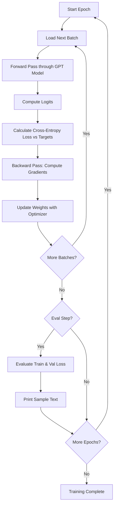
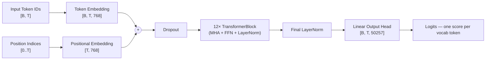
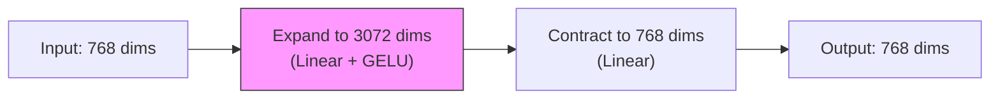
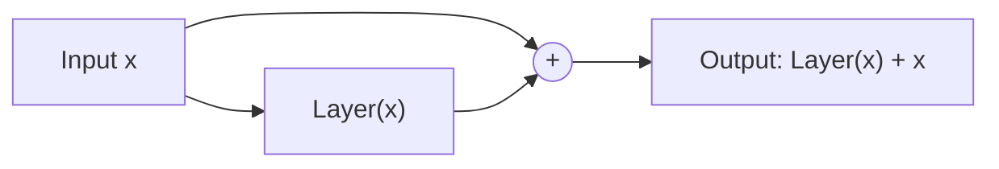
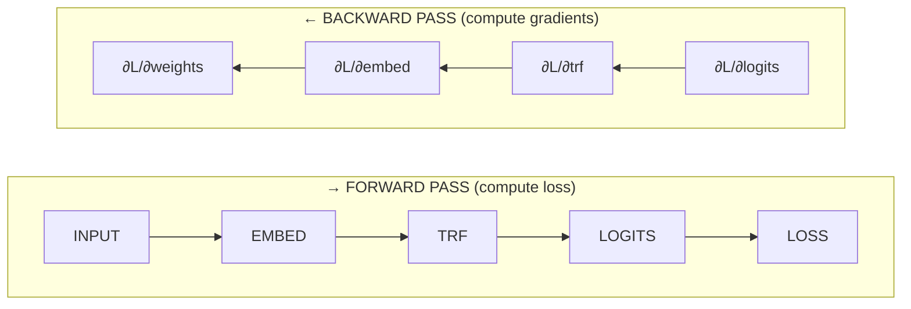
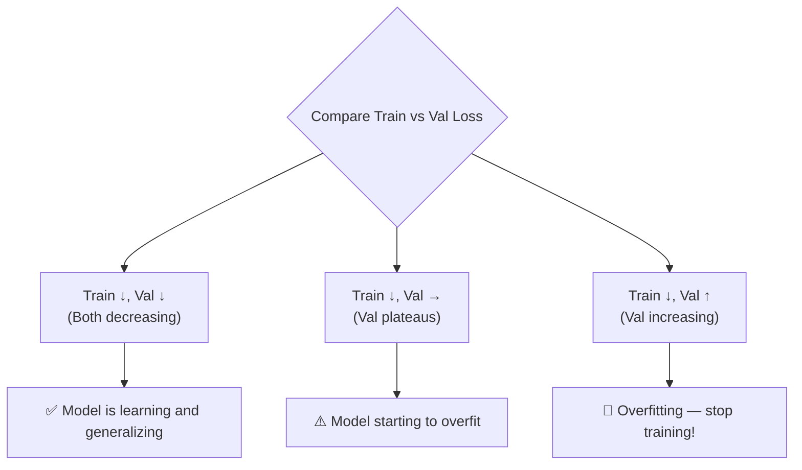
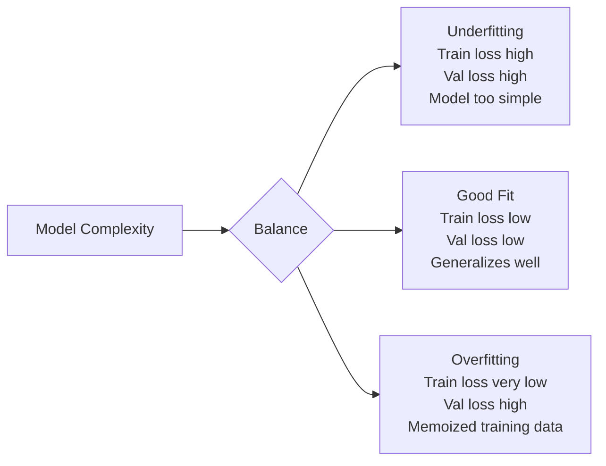
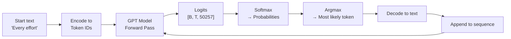
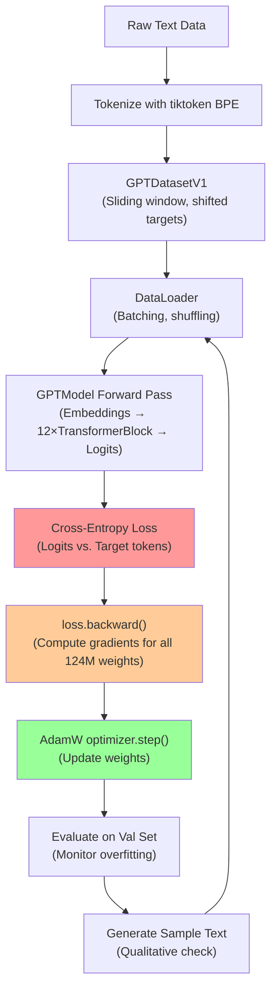

# 📘 LLM Study Guide — Lecture 28: How to Train Your LLM (Pre-Training Loop)

> **Course Roadmap Position:** This lecture builds on the GPT architecture assembled in prior sessions and focuses entirely on the *training process* — how a randomly initialized model learns to generate coherent text through gradient descent, loss computation, and iterative weight updates.

---

## 🗺️ Table of Contents

1. [Big Picture: What Does "Training an LLM" Mean?](#1-big-picture)
2. [The Pre-Training Loop — Overview](#2-pretraining-loop)
3. [GPT Model Configuration & Architecture Recap](#3-gpt-config)
4. [Layer Normalization — Stabilizing Deep Networks](#4-layer-norm)
5. [GELU Activation & Feed-Forward Networks](#5-gelu-ffn)
6. [Shortcut (Residual) Connections — Fighting Vanishing Gradients](#6-shortcuts)
7. [Parameter Count — Understanding GPT-2's 124M Parameters](#7-params)
8. [The Loss Function: Cross-Entropy Explained](#8-loss)
9. [Backpropagation — The Engine of Learning](#9-backprop)
10. [Dataset Preparation & DataLoader](#10-dataset)
11. [The Training Loop — Full Implementation](#11-training-loop)
12. [Evaluation: Train Loss vs. Validation Loss](#12-evaluation)
13. [Perplexity — A Human-Readable Metric](#13-perplexity)
14. [Gradient Descent & the AdamW Optimizer](#14-optimizer)
15. [Overfitting, Underfitting & How to Detect Them](#15-overfitting)
16. [Text Generation: From Logits to Words](#16-text-gen)
17. [Common Mistakes & Best Practices](#17-best-practices)
18. [Summary & Key Takeaways](#18-summary)

---

## 1. Big Picture: What Does "Training an LLM" Mean? {#1-big-picture}

### Simple Explanation

Imagine teaching a child to complete sentences. You show them: *"The cat sat on the ___"* and they guess *"mat"*. If they're wrong, you correct them. Over millions of such corrections, they get really good at predicting what word comes next.

Training an LLM is exactly the same idea — but with billions of parameters (weights) instead of a child's neurons, and trillions of tokens instead of a few sentences.

### What Happens During Training?

```
Raw Text → Tokenize → Feed to Model → Get Logits → 
Compare to Targets → Compute Loss → Backprop → Update Weights
```

The model starts with **random weights** and can't generate coherent text. After training, its weights encode statistical patterns of language.

### Real-World Example

- **GPT-2 (124M params):** Trained on 40GB of web text (WebText dataset)
- **LLaMA 2 7B:** Trained on 2 *trillion* tokens, requiring 184,320 A100 GPU hours (~$690,000 at AWS prices)
- **Our educational example:** Trained on a single short story (5,146 tokens) in ~20 minutes on CPU

### The Core Formula

```
Better Weights = Current Weights − Learning Rate × Gradient of Loss
```

This is gradient descent — the mathematical heart of all deep learning.

---

## 2. The Pre-Training Loop — Overview {#2-pretraining-loop}

### What Is an Epoch?

An **epoch** is one complete pass over the entire training dataset. During each epoch:

- The dataset is split into **batches**
- Each batch is processed sequentially
- Model weights are updated after every batch



### The 8-Step Training Loop (from the lecture PDF)

| Step | Action | PyTorch Code |
|------|--------|-------------|
| 1 | Iterate over training epochs | `for epoch in range(num_epochs)` |
| 2 | Iterate over batches | `for input_batch, target_batch in train_loader` |
| 3 | Reset loss gradients from previous batch | `optimizer.zero_grad()` |
| 4 | Calculate loss on current batch | `loss = cal_loss_batch(...)` |
| 5 | Backward pass to calculate gradients | `loss.backward()` |
| 6 | Update model weights using loss gradients | `optimizer.step()` |
| 7 | Print training and validation losses | Every `eval_freq` steps |
| 8 | Generate sample text for inspection | After each epoch |

> **Why reset gradients first?** PyTorch *accumulates* gradients by default. If you don't zero them out, gradients from the previous batch add to the current one, causing incorrect updates.

---

## 3. GPT Model Configuration & Architecture Recap {#3-gpt-config}

### GPT-2 124M Configuration

```python
GPT_CONFIG_124M = {
    "vocab_size": 50257,    # Number of unique tokens (BPE tokenizer)
    "context_length": 1024, # Max tokens the model can "see" at once
    "emb_dim": 768,         # Size of each token's embedding vector
    "n_heads": 12,          # Number of attention heads per layer
    "n_layers": 12,         # Number of transformer blocks stacked
    "drop_rate": 0.1,       # 10% of neurons randomly dropped during training
    "qkv_bias": False       # No bias in Query/Key/Value projections
}
```

### The GPT Forward Pass

```python
class GPTModel(nn.Module):
    def __init__(self, cfg):
        super().__init__()
        self.tok_emb  = nn.Embedding(cfg["vocab_size"], cfg["emb_dim"])   # Token embeddings
        self.pos_emb  = nn.Embedding(cfg["context_length"], cfg["emb_dim"]) # Positional embeddings
        self.drop_emb = nn.Dropout(cfg["drop_rate"])
        self.trf_blocks = nn.Sequential(
            *[TransformerBlock(cfg) for _ in range(cfg["n_layers"])]
        )
        self.final_norm = LayerNorm(cfg["emb_dim"])
        self.out_head   = nn.Linear(cfg["emb_dim"], cfg["vocab_size"], bias=False)

    def forward(self, in_idx):
        batch_size, seq_len = in_idx.shape
        tok_embeds = self.tok_emb(in_idx)                           # [B, T, 768]
        pos_embeds = self.pos_emb(torch.arange(seq_len))            # [T, 768]
        x = tok_embeds + pos_embeds                                  # [B, T, 768]
        x = self.drop_emb(x)
        x = self.trf_blocks(x)                                       # 12 transformer layers
        x = self.final_norm(x)
        logits = self.out_head(x)                                    # [B, T, 50257]
        return logits
```

### Architecture Flow



**Key Insight:** The output shape is `[batch_size, seq_len, vocab_size]` — for every token position, we get a 50,257-dimensional vector of scores, one per possible next word.

---

## 4. Layer Normalization — Stabilizing Deep Networks {#4-layer-norm}

### Why Do We Need It?

Deep networks suffer from **internal covariate shift** — activations at each layer can drift to very large or very small values, making training slow or unstable. Layer normalization fixes this by keeping activations zero-mean and unit-variance.

### Simple Analogy

Think of layer norm like grading on a curve. No matter how hard or easy the test was, the scores get rescaled so the class mean is 0 and the standard deviation is 1. Everyone's *relative* performance is preserved, but the absolute scale is controlled.

### The Math

```
Layer Norm(x) = γ × (x − μ) / (σ + ε) + β
```

Where:
- `μ` = mean of the layer's activations
- `σ` = standard deviation of the layer's activations  
- `ε` = tiny constant (1e-5) to avoid division by zero
- `γ` (scale) and `β` (shift) are **learned parameters** — the model can choose to undo the normalization if needed

### Code Example

```python
class LayerNorm(nn.Module):
    def __init__(self, emb_dim):
        super().__init__()
        self.eps   = 1e-5
        self.scale = nn.Parameter(torch.ones(emb_dim))   # γ — learned
        self.shift = nn.Parameter(torch.zeros(emb_dim))  # β — learned

    def forward(self, x):
        mean = x.mean(dim=-1, keepdim=True)
        var  = x.var(dim=-1, keepdim=True, unbiased=False)
        x_norm = (x - mean) / torch.sqrt(var + self.eps)
        return self.scale * x_norm + self.shift
```

### Layer Norm vs Batch Norm — Key Difference

| Property | Batch Norm | Layer Norm |
|----------|-----------|-----------|
| Normalizes across | Batch dimension | Feature dimension |
| Works well with | CNNs, fixed batch sizes | Transformers, variable seq length |
| Sensitive to batch size | Yes | No |
| Used in GPT | ❌ | ✅ |

> **Where is LayerNorm applied in GPT?** Before the attention mechanism and before the feed-forward network (Pre-LN style). This is the "Pre-Layer Normalization" approach, which is more stable than the original "Post-LN" in the 2017 Transformer paper.

### Section Summary

Layer Normalization is applied before each sub-layer in the TransformerBlock. It keeps activations in a healthy range, prevents gradient explosion/vanishing, and allows the model to train stably even with 12 stacked layers.

---

## 5. GELU Activation & Feed-Forward Networks {#5-gelu-ffn}

### What Is an Activation Function?

After a linear transformation (a weighted sum), we need a **non-linearity** — otherwise, stacking 12 linear layers is mathematically equivalent to just one linear layer, and the model can't learn complex patterns.

### GELU vs ReLU

**ReLU** (the classic): simply clips negatives to zero.  
```
ReLU(x) = max(0, x)
```

**GELU** (used in GPT): a smoother version that allows small negative values near zero.  
```
GELU(x) ≈ 0.5 × x × (1 + tanh(√(2/π) × (x + 0.044715 × x³)))
```

Why does smoothness matter? GELU provides a continuous gradient everywhere, which leads to slightly better training dynamics for transformers.

```python
class GELU(nn.Module):
    def forward(self, x):
        return 0.5 * x * (1 + torch.tanh(
            torch.sqrt(torch.tensor(2.0 / torch.pi)) *
            (x + 0.044715 * torch.pow(x, 3))
        ))
```

### The Feed-Forward Network (FFN)

Each transformer block contains an FFN that processes each token independently:

```python
class FeedForward(nn.Module):
    def __init__(self, cfg):
        super().__init__()
        self.layers = nn.Sequential(
            nn.Linear(cfg["emb_dim"], 4 * cfg["emb_dim"]),  # 768 → 3072 (expand ×4)
            GELU(),
            nn.Linear(4 * cfg["emb_dim"], cfg["emb_dim"]),  # 3072 → 768 (contract)
        )

    def forward(self, x):
        return self.layers(x)
```

### Why Expand and Then Contract?



The 4× expansion into a higher-dimensional space gives the model room to learn richer, more complex representations. The contraction brings it back to the standard embedding dimension so layers can be stacked cleanly.

> **Parameter count of one FFN:** 768×3072 + 3072×768 = ~4.72M parameters

### Section Summary

The FFN applies two linear transformations with a GELU non-linearity between them. The intermediate 4× expansion allows each transformer block to learn complex token-level transformations. Input and output dimensions are identical, enabling clean stacking of 12 transformer blocks.

---

## 6. Shortcut (Residual) Connections — Fighting Vanishing Gradients {#6-shortcuts}

### The Vanishing Gradient Problem

When you stack many layers, gradients must travel backward through each layer during backpropagation. If each layer multiplies the gradient by a number less than 1, by the time it reaches the early layers, the gradient approaches zero — those layers stop learning. This is the **vanishing gradient problem**.

### The Solution: Skip the Signal Directly

Residual connections (also called "skip connections" or "shortcut connections") add the *input* of a layer directly to its *output*:

```
output = layer(x) + x
```



### Proof: Gradient Flow With vs. Without Shortcuts

```python
def print_gradient(model, x):
    output = model(x)
    target = torch.tensor([[0.0]])
    loss = nn.MSELoss()(output, target)
    loss.backward()
    for name, param in model.named_parameters():
        if 'weight' in name:
            print(f'{name}: gradient mean = {param.grad.abs().mean().item():.8f}')
```

**Without shortcuts** (observed output from the notebook):
```
layers.0.0.weight: gradient mean = 0.00068756   ← nearly zero!
layers.1.0.weight: gradient mean = 0.00190839
layers.2.0.weight: gradient mean = 0.00382054
layers.3.0.weight: gradient mean = 0.00386103
layers.4.0.weight: gradient mean = 0.00517791   ← much larger
```
Early layers (0, 1) receive ~7× smaller gradients than later layers. They learn much more slowly — this is the vanishing gradient problem in action.

**With shortcuts:** all layers receive gradients of similar magnitude, enabling uniform learning across all depths.

### Why This Matters for GPT

GPT has 12 transformer blocks. Without residual connections, the embedding layers (deepest from the loss) would barely learn. With residual connections, the gradient "highway" ensures every layer trains effectively.

```python
# The residual connection in TransformerBlock's forward():
def forward(self, x):
    # Shortcut 1: around the attention sub-layer
    shortcut = x
    x = self.norm1(x)
    x = self.att(x)
    x = self.drop_shortcut(x)
    x = x + shortcut          # Add original input back

    # Shortcut 2: around the FFN sub-layer
    shortcut = x
    x = self.norm2(x)
    x = self.ff(x)
    x = self.drop_shortcut(x)
    x = x + shortcut          # Add original input back
    return x
```

### Section Summary

Residual connections are a critical architectural choice in all modern deep learning. They create "gradient highways" that allow gradients to flow backward through many layers without vanishing. In GPT, every transformer block uses two such shortcuts — one around attention, one around the FFN.

---

## 7. Parameter Count — Understanding GPT-2's 124M Parameters {#7-params}

### Where Do All the Parameters Come From?

From the lecture PDF, here's the breakdown for GPT-2 124M:

#### Embedding Layers

| Component | Calculation | Count |
|-----------|------------|-------|
| Token embeddings | 50,257 × 768 | ~38.6M |
| Positional embeddings | 1,024 × 768 | ~0.79M |
| **Embedding total** | | **~39.4M** |

#### One Transformer Block

| Component | Calculation | Count |
|-----------|------------|-------|
| Multi-head attention (Q, K, V weights) | 3 × 768 × 768 | ~1.77M |
| Output projection | 768 × 768 | ~0.59M |
| Feed-forward (expand + contract) | 768×3072 + 3072×768 | ~4.72M |
| LayerNorm parameters (2 per block) | 2 × 2 × 768 | ~3K |
| **One block total** | | **~7.1M** |

#### Full Model

| Component | Count |
|-----------|-------|
| 12 Transformer blocks | 12 × 7.1M ≈ 85.2M |
| Embedding layers | ~39.4M |
| Final linear (output head, weight-tied) | ~0 (shared with token embeddings) |
| **Total** | **~124M** |

### Weight Tying — A Clever Efficiency

The output head (768 → 50,257) shares weights with the token embedding (50,257 → 768). This reduces parameters by ~38.6M and also makes sense semantically — the model uses the same representation for input and output tokens.

```python
# From the notebook:
print("Token embedding layer shape: ", model.tok_emb.weight.shape)  # [50257, 768]
print("Output layer shape:", model.out_head.weight.shape)            # [50257, 768]
# They are the same shape — and in practice, the same tensor
```

### Gradient Descent on 124M Parameters

For each of these 124M parameters, the training loop computes:
1. How much did this parameter contribute to the loss? (via backprop)
2. In which direction should it move to reduce the loss?
3. By how much? (learning rate × gradient)

```
ω = ω − lr × (∂L/∂ω)
```

---

## 8. The Loss Function: Cross-Entropy Explained {#8-loss}

### What Is Cross-Entropy Loss?

Cross-entropy loss measures how wrong the model's predictions are. Specifically, it measures the "surprise" of seeing the correct answer given the model's probability distribution.

### Simple Example

Suppose the model is predicting the next word after "The cat sat on the":

| Token | Model's Probability | Correct? |
|-------|-------------------|---------|
| "mat" | 0.60 | ✅ |
| "floor" | 0.30 | ❌ |
| "dog" | 0.08 | ❌ |
| ... | ... | ... |

Cross-entropy loss = `-log(0.60)` = 0.51 ← small loss, model was fairly confident and correct.

Now if the model gave "mat" only 0.01 probability:  
Cross-entropy loss = `-log(0.01)` = 4.60 ← large loss, model was wrong and confident about it.

### Mathematical Definition

```
CE Loss = -1/N × Σ log(P(correct_token | context))
```

Where `N` is the number of tokens, and `P(correct_token)` is the model's predicted probability for the true next token.

### PyTorch Implementation

```python
def cal_loss_batch(input_batch, target_batch, model, device):
    input_batch  = input_batch.to(device)
    target_batch = target_batch.to(device)
    
    logits = model(input_batch)   # Shape: [batch_size, seq_len, vocab_size]
    
    loss = torch.nn.functional.cross_entropy(
        logits.flatten(0, 1),    # Reshape to [batch_size × seq_len, vocab_size]
        target_batch.flatten()   # Reshape to [batch_size × seq_len]
    )
    return loss
```

### Why Flatten?

PyTorch's `cross_entropy` expects 2D input `[N, C]` where N is samples and C is classes. We flatten the batch and sequence dimensions together so every token prediction becomes an independent sample.

```
Input:  logits [2, 4, 50257]  → flatten(0,1) → [8, 50257]
Target: [2, 4]                → flatten()    → [8]
```

### What Loss Values Mean

| Loss Value | Interpretation |
|------------|---------------|
| ~10.8 | Untrained model (random guessing over ~50K vocab: log(50257) ≈ 10.8) |
| ~5.0 | Model learning patterns |
| ~2.0 | Model overfitting to training data |
| ~1.0 | Very good fit (or severe overfitting) |

> **Key insight:** An untrained model should produce loss ≈ ln(vocab_size) ≈ 10.82. Our notebook confirms: Training loss 10.98 before any training. This is a sanity check you should always run!

### Section Summary

Cross-entropy loss quantifies how far the model's predicted probability distribution is from the true one. Lower loss = better predictions. The loss is computed for every token in every batch, then averaged. It is the signal that drives all weight updates.

---

## 9. Backpropagation — The Engine of Learning {#9-backprop}

### What Is Backpropagation?

Backpropagation is the algorithm that computes how much each weight in the network contributed to the final loss. It works by applying the **chain rule of calculus** backward through the computation graph.

### The Chain Rule in Plain English

If A affects B, and B affects C, then to find how A affects C, we multiply: (how A affects B) × (how B affects C).

In neural networks: to find how weight `w` in layer 1 affects the final loss, we multiply gradients through every subsequent layer.

### Forward Pass vs Backward Pass



### PyTorch Makes This Automatic

```python
# Forward pass — PyTorch builds a computation graph automatically
logits = model(input_batch)
loss   = cross_entropy(logits.flatten(0,1), targets.flatten())

# Backward pass — PyTorch traverses the graph in reverse
loss.backward()

# Now every parameter has a .grad attribute
for name, param in model.named_parameters():
    print(f"{name}: gradient = {param.grad}")
```

### The Main Step from the Lecture PDF

The lecture highlights: **"Main Step: Find loss gradient using `loss.backward()`"**

This single call:
1. Traverses the entire computation graph from loss to inputs
2. Computes `∂L/∂w` for every weight `w` in the 124M parameters
3. Stores the gradient in `param.grad`
4. Is the reason we say "this whole operation is differentiable"

### Weight Update Formula

```
ω_new = ω_old − lr × (∂L/∂ω)
```

Or in code:
```python
optimizer.step()  # Applies this formula for all 124M parameters simultaneously
```

> **Common mistake:** Forgetting `optimizer.zero_grad()` before `loss.backward()`. PyTorch accumulates gradients, so without zeroing, you get the sum of gradients from all previous batches — completely corrupting your update.

---

## 10. Dataset Preparation & DataLoader {#10-dataset}

### The Next-Token Prediction Task

LLMs are trained to predict the next token given all previous tokens. This means **targets are just inputs shifted by one position**:

```
Input:  ["Every", "effort", "moves",  "you"]
Target: ["effort", "moves", "you",    "forward"]
```

The model sees the input, and for each position, tries to predict what comes next.

### The GPT Dataset Class

```python
class GPTDatasetV1(Dataset):
    def __init__(self, txt, tokenizer, max_length, stride):
        self.input_idx  = []
        self.target_idx = []
        
        token_idx = tokenizer.encode(txt, allowed_special={'<|endoftext|>'})
        
        # Sliding window: create overlapping chunks
        for i in range(0, len(token_idx) - max_length, stride):
            input_chunk  = token_idx[i : i + max_length]
            target_chunk = token_idx[i+1 : i + max_length + 1]  # Shifted by 1
            self.input_idx.append(torch.tensor(input_chunk))
            self.target_idx.append(torch.tensor(target_chunk))
```

### The Sliding Window Strategy

```
Text tokens: [A, B, C, D, E, F, G, H, ...]
max_length=4, stride=2

Window 1:  Input=[A,B,C,D]  Target=[B,C,D,E]
Window 2:  Input=[C,D,E,F]  Target=[D,E,F,G]
Window 3:  Input=[E,F,G,H]  Target=[F,G,H,I]
```

The stride controls overlap — smaller stride = more samples but more redundancy.

### Train/Validation Split

```python
# 90% training, 10% validation
train_ratio = 0.90
split_idx   = int(train_ratio * len(text_data))

train_loader = create_dataloader_v1(text_data[:split_idx], batch_size=2, max_length=256, stride=128, shuffle=True, drop_last=True)
val_loader   = create_dataloader_v1(text_data[split_idx:], batch_size=2, max_length=256, stride=128, shuffle=False, drop_last=False)
```

**From our dataset (5,146 tokens):**
- Training tokens: 4,608
- Validation tokens: 512
- Total: 5,120

### Section Summary

The DataLoader handles: tokenizing the text, creating sliding window input/target pairs, batching, shuffling (training only), and feeding data to the model. The target is always the input shifted by one position — this is the "next-token prediction" objective that powers all GPT-style models.

---

## 11. The Training Loop — Full Implementation {#11-training-loop}

### Complete Training Function

```python
def train_model_sample(model, train_loader, val_loader, optimizer, device,
                        num_epochs, eval_freq, eval_iter, start_context, tokenizer):
    
    train_losses, val_losses, track_tokens_seen = [], [], []
    tokens_seen, global_steps = 0, -1

    for epoch in range(num_epochs):
        model.train()  # Enable dropout (training mode)

        for input_batch, target_batch in train_loader:
            # STEP 3: Reset gradients from previous batch
            optimizer.zero_grad()
            
            # STEP 4: Forward pass + compute loss
            loss = cal_loss_batch(input_batch, target_batch, model, device)
            
            # STEP 5: Backward pass — compute all gradients
            loss.backward()
            
            # STEP 6: Update all 124M weights
            optimizer.step()
            
            tokens_seen  += input_batch.numel()
            global_steps += 1

            # STEP 7: Periodic evaluation
            if global_steps % eval_freq == 0:
                train_loss, val_loss = evaluate_model(
                    model, train_loader, val_loader, device, eval_iter
                )
                train_losses.append(train_loss)
                val_losses.append(val_loss)
                track_tokens_seen.append(tokens_seen)
                print(f"Ep {epoch+1} (Step {global_steps:06d}): "
                      f"Train loss {train_loss:.3f}, Val loss {val_loss:.3f}")

        # STEP 8: Generate sample after each epoch
        generate_and_print_sample(model, tokenizer, device, start_context)

    return train_losses, val_losses, track_tokens_seen
```

### Training Output — Watching the Model Learn

This is the actual output from training on "the-verdict.txt" for 10 epochs:

```
Ep 1 (Step 000000): Train loss 10.506, Val loss 10.576
Ep 1 (Step 000005): Train loss 9.230, Val loss 9.416
"Every effort moves you,,,,,,,,,,,,,,,,,"       ← gibberish (random weights)

Ep 3 (Step 000020): Train loss 7.610, Val loss 7.968
"Every effort moves you, the the the the the"   ← learning common words

Ep 5 (Step 000040): Train loss 5.872, Val loss 6.810
"Every effort moves you, and I had the the"     ← learning sentence structure

Ep 8 (Step 000065): Train loss 4.164, Val loss 6.283
"Every effort moves you know the picture--"     ← learning meaningful phrases

Ep 10 (Step 000085): Train loss 2.997, Val loss 6.228
"Every effort moves you know it was not that"   ← memorizing training text
```

> **What you're witnessing:** The model progressing from random token spam → common tokens → grammatical patterns → meaningful sentences → training set memorization. The growing gap between train (2.997) and val (6.228) loss in late epochs signals overfitting.

### Training Hyperparameters Used

```python
optimizer  = torch.optim.AdamW(model.parameters(), lr=1e-4, weight_decay=1e-2)
num_epochs = 10
eval_freq  = 5   # Evaluate every 5 steps
eval_iter  = 5   # Use 5 batches for evaluation
```

---

## 12. Evaluation: Train Loss vs. Validation Loss {#12-evaluation}

### The Evaluation Function

```python
def evaluate_model(model, train_loader, val_loader, device, eval_iter):
    model.eval()             # Disable dropout during evaluation
    with torch.no_grad():    # Don't track gradients (saves memory and compute)
        train_loss = calc_loss_loader(train_loader, model, device, num_batches=eval_iter)
        val_loss   = calc_loss_loader(val_loader,   model, device, num_batches=eval_iter)
    model.train()            # Re-enable dropout for training
    return train_loss, val_loss
```

### Why Two Separate Loss Values?

| Loss | What It Measures | Useful For |
|------|-----------------|-----------|
| Training loss | How well model fits training data | Confirming learning is happening |
| Validation loss | How well model generalizes to unseen data | Detecting overfitting |

### Interpreting the Results



### model.eval() vs model.train() — Why This Matters

| Mode | Dropout | Behavior |
|------|---------|---------|
| `model.train()` | Active (randomly zeros neurons) | Stochastic, for gradient updates |
| `model.eval()` | Disabled (deterministic) | Reproducible, for measurement |

> **Best practice:** Always use `with torch.no_grad():` during evaluation. This prevents PyTorch from building a computation graph for the backward pass, saving ~50% memory and making evaluation faster.

---

## 13. Perplexity — A Human-Readable Metric {#13-perplexity}

### What Is Perplexity?

Perplexity answers the question: **"On average, how many words is the model equally confused between at each step?"**

```
Perplexity = e^(cross-entropy loss) = torch.exp(loss)
```

### Examples

| Loss | Perplexity | Meaning |
|------|-----------|---------|
| 10.8 | ~48,725 | Untrained: effectively random over ~50K vocab |
| 5.0  | ~148 | Model narrowed down to ~148 equally likely words |
| 2.0  | ~7.4 | Model mostly knows what comes next |
| 1.0  | ~2.7 | Model is very confident |

### Code

```python
perplexity = torch.exp(loss)
print("Perplexity:", perplexity)
# Ep 1: Perplexity: tensor(48726.5195)  ← random at start
# Ep 10: lower perplexity as model learns
```

### Perplexity in the Real World

| Model | Perplexity (WikiText-2) |
|-------|------------------------|
| Random baseline | ~50,000 |
| GPT-2 (124M) | ~29.4 |
| GPT-2 (1.5B) | ~17.5 |
| GPT-3 (175B) | ~20.5 |
| LLaMA 2 (70B) | ~3.3 |

Lower is better. GPT-4 class models achieve perplexity close to 3-5 on standard benchmarks.

> **Why use perplexity instead of just loss?** It's more interpretable — saying "perplexity 30" tells you something meaningful about vocabulary uncertainty. "Loss 3.4" is harder to reason about intuitively.

---

## 14. Gradient Descent & the AdamW Optimizer {#14-optimizer}

### Basic Gradient Descent

The simplest weight update rule:

```
weight = weight - learning_rate × gradient
```

If gradient is positive → weight is too large → decrease it.  
If gradient is negative → weight is too small → increase it.

### Problem: Gradient Descent Is Too Simple

- **Naive GD:** Updates all parameters with the same learning rate — inefficient
- **SGD (Stochastic):** One sample at a time — noisy
- **Adam:** Adapts learning rate per parameter, uses momentum

### Adam: The Key Improvements

Adam maintains two moving averages for each parameter:

```
m_t = β₁ × m_{t-1} + (1 - β₁) × gradient        # Momentum (direction memory)
v_t = β₂ × v_{t-1} + (1 - β₂) × gradient²        # Velocity (magnitude memory)

weight = weight - lr × m_t / (√v_t + ε)
```

This means:
- Parameters with consistently large gradients get smaller effective learning rates
- Parameters with noisy/inconsistent gradients get smoother updates

### AdamW: Adam + Weight Decay

AdamW adds **weight decay** — a regularization technique that penalizes large weights:

```
weight = weight - lr × gradient - lr × weight_decay × weight
```

This prevents the model from assigning too much importance to any single feature, reducing overfitting.

```python
optimizer = torch.optim.AdamW(
    model.parameters(),
    lr=1e-4,           # Learning rate: 0.0001
    weight_decay=1e-2  # L2 penalty: 0.01
)
```

### Learning Rate: The Most Critical Hyperparameter

| Learning Rate | Effect |
|--------------|--------|
| Too high (e.g., 1e-1) | Loss oscillates or explodes |
| Just right (e.g., 1e-4) | Smooth, steady decrease in loss |
| Too low (e.g., 1e-8) | Training takes forever |

> **Pro tip:** For LLM fine-tuning, 1e-4 to 5e-5 is a common range. For pretraining from scratch, even lower rates with warm-up schedules are used.

---

## 15. Overfitting, Underfitting & How to Detect Them {#15-overfitting}

### The Fundamental Tension



### Our Training Results Show Overfitting

```
Epoch 5:  Train 5.872, Val 6.810  → Gap: 0.938  (acceptable)
Epoch 8:  Train 4.164, Val 6.283  → Gap: 2.119  (warning)
Epoch 10: Train 2.997, Val 6.228  → Gap: 3.231  (overfitting)
```

The validation loss barely improves (6.810 → 6.228) while training loss drops dramatically (5.872 → 2.997). The model is memorizing the 5,145-token training set.

### Prevention Strategies

| Strategy | How It Helps | PyTorch Implementation |
|----------|-------------|----------------------|
| **Dropout** | Randomly zeros neurons → forces redundancy | `nn.Dropout(0.1)` |
| **Weight Decay** | Penalizes large weights | `AdamW(weight_decay=1e-2)` |
| **More Data** | Harder to memorize | Larger training corpus |
| **Early Stopping** | Stop when val loss stops improving | Manual check in training loop |
| **Regularization** | L1/L2 penalties | Part of AdamW |

### Monitoring: The Loss Curve

```
Loss
 │
 │ ╲ Training loss
 │  ╲____
 │       ╲
 │        ╲___          ← Val loss plateaus → stop here
 │             ╲___/─────────────────────────────
 │
 └───────────────────────────────────────── Epochs
         ↑                    ↑
    Both decreasing      Gap is widening (overfitting)
```

> **From the lecture:** The training loss curve and validation loss curve should be tracked together. When the training set loss decreases past epoch 2, the model improves, but the validation loss increase past epoch 2 signals overfitting.

---

## 16. Text Generation: From Logits to Words {#16-text-gen}

### The Generation Pipeline



### The generate_text_simple Function

```python
def generate_text_simple(model, idx, max_new_tokens, context_size):
    for _ in range(max_new_tokens):
        # Crop context to max size (GPT-2: 1024 tokens)
        idx_cond = idx[:, -context_size:]
        
        with torch.no_grad():
            logits = model(idx_cond)          # [B, T, 50257]
        
        # Focus only on the last token's prediction
        logits = logits[:, -1, :]            # [B, 50257]
        
        # Convert to probabilities and pick the most likely token
        probas  = torch.softmax(logits, dim=-1)
        idx_next = torch.argmax(probas, dim=-1, keepdim=True)  # Greedy decoding
        
        # Append predicted token to sequence
        idx = torch.cat((idx, idx_next), dim=1)
    
    return idx
```

### Greedy Decoding vs. Sampling

| Method | How It Works | Pros | Cons |
|--------|-------------|------|------|
| **Greedy (argmax)** | Always picks the most probable token | Deterministic, fast | Repetitive, boring |
| **Top-k sampling** | Sample from top k probable tokens | More diverse | Randomness |
| **Top-p (nucleus)** | Sample from tokens covering p% probability | Natural diversity | Harder to control |
| **Temperature** | Scale logits before softmax | Controls confidence | Needs tuning |

Our `generate_text_simple` uses greedy decoding — that's why the early output is full of repeated commas and "the the the".

### Helper Functions

```python
def text_token_ids(text, tokenizer):
    """Convert text string to token ID tensor"""
    encoded = tokenizer.encode(text, allowed_special={'<|endoftext|>'})
    return torch.tensor(encoded).unsqueeze(0)  # Add batch dimension

def token_ids_to_text(token_ids, tokenizer):
    """Convert token ID tensor back to text string"""
    flat = token_ids.squeeze(0)  # Remove batch dimension
    return tokenizer.decode(flat.tolist())
```

---

## 17. Common Mistakes & Best Practices {#17-best-practices}

### ❌ Common Mistakes

**1. Forgetting `optimizer.zero_grad()`**
```python
# WRONG — gradients accumulate across batches!
for input_batch, target_batch in train_loader:
    loss = cal_loss_batch(...)
    loss.backward()
    optimizer.step()

# CORRECT
for input_batch, target_batch in train_loader:
    optimizer.zero_grad()   # ← Always first!
    loss = cal_loss_batch(...)
    loss.backward()
    optimizer.step()
```

**2. Not switching between `model.train()` and `model.eval()`**
```python
# WRONG — dropout active during evaluation gives different results each time
def evaluate_model(model, ...):
    train_loss = calc_loss_loader(train_loader, model, ...)  # Dropout ON!

# CORRECT
def evaluate_model(model, ...):
    model.eval()
    with torch.no_grad():
        train_loss = calc_loss_loader(train_loader, model, ...)
    model.train()
```

**3. Not using `torch.no_grad()` during inference**  
Without it, PyTorch builds a computation graph for backward pass that you never use — wastes ~2× memory.

**4. Moving data but not model to device (or vice versa)**
```python
# CORRECT — both model and data on same device
model.to(device)
input_batch = input_batch.to(device)
target_batch = target_batch.to(device)
```

**5. Ignoring the gap between train and validation loss**  
When train loss << val loss, you're overfitting. More data or regularization needed.

### ✅ Best Practices

**1. Sanity check loss before training**
```python
# Untrained model should have loss ≈ log(vocab_size) ≈ 10.82
# If it's wildly different, something is wrong
```

**2. Monitor both losses and generate text samples**
```python
# Text quality is the best qualitative check
# "Every effort moves you, the, the, the" → model is learning common words
```

**3. Track tokens seen, not just epochs**
```python
# Different batch sizes mean different epochs don't mean the same thing
# Tokens seen is a universal measure of training exposure
track_tokens_seen.append(tokens_seen)
```

**4. Always verify output shapes**
```python
# Expected: [batch_size, seq_len, vocab_size]
assert logits.shape == (2, 10, 50257), "Shape mismatch!"
```

**5. Use `manual_seed` for reproducibility**
```python
torch.manual_seed(123)  # Ensures reproducible weight initialization and data shuffling
```

---

## 18. Summary & Key Takeaways {#18-summary}

### The Complete Training Pipeline



### Key Concepts Summary Table

| Concept | What It Does | Why It Matters |
|---------|-------------|----------------|
| **Epoch** | One full pass over training data | Measures training progress |
| **Batch** | Subset of data processed together | Enables GPU parallelism |
| **Cross-Entropy Loss** | Measures prediction error | The signal for all learning |
| **Backpropagation** | Computes gradients via chain rule | How weights know which direction to move |
| **Gradient Descent** | Updates weights to reduce loss | The learning mechanism |
| **AdamW** | Adaptive per-parameter LR + weight decay | Efficient, regularized training |
| **Layer Norm** | Normalizes activations | Stable training, prevents gradient issues |
| **Residual Connections** | Skip connections around sub-layers | Prevents vanishing gradients |
| **GELU** | Smooth non-linearity in FFN | Better gradients than ReLU |
| **Dropout** | Random neuron zeroing | Regularization against overfitting |
| **Perplexity** | exp(loss) | Human-interpretable uncertainty metric |
| **Weight Tying** | Shared embedding/output weights | Reduces 38M parameters |

### The Three Things That Make This Work

1. **Differentiability** — every operation from input to loss is differentiable, enabling backpropagation to flow gradients all the way to the embedding layer.

2. **Scale** — 124M parameters give the model enough capacity to represent language statistics. More parameters → more capacity, but also more data needed.

3. **The Pre-training Objective** — next-token prediction is simple, self-supervised, and scalable. No human labels required — the text itself provides infinite supervision.

### Practical Takeaways

- A training loss of ~10.8 for an untrained GPT-2 is *expected* — use this as a sanity check.
- Validation loss tells you about generalization; never optimize only on training loss.
- With only 5,000 tokens, overfitting is inevitable — real LLM training uses billions to trillions of tokens.
- The training loop in this lecture is the same fundamental loop used for GPT-4, LLaMA, Gemini — just at incomparably larger scale.

---

> **Next Steps:** After pre-training, the model knows language statistics but doesn't yet follow instructions. The next stage is **fine-tuning** (instruction tuning, RLHF) — teaching the model to be a helpful assistant rather than just a next-token predictor.

---

*Study Guide compiled from Lecture 28 lecture notes and the accompanying `LLM_-_28.ipynb` notebook implementing a GPT-2 124M model from scratch in PyTorch.*
